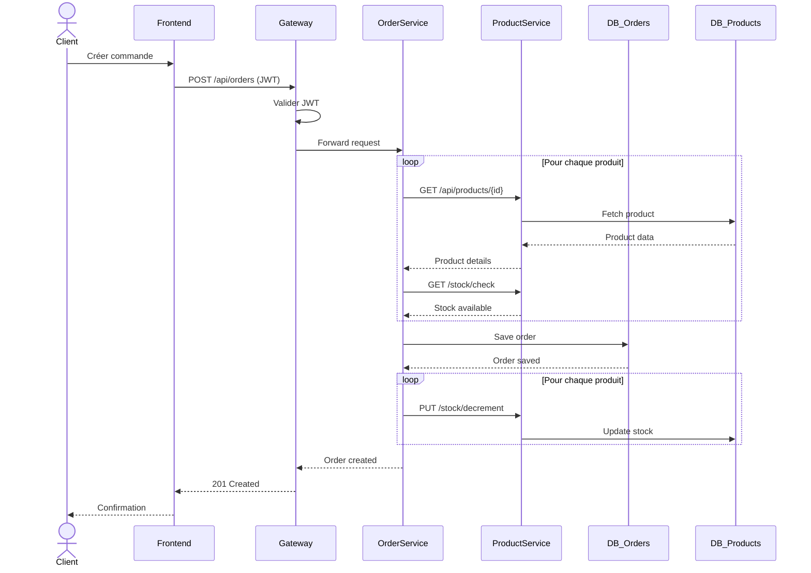

# 🛒 Secure Microservices - Gestion Produits & Commandes

[](https://spring.io/projects/spring-boot)
[](https://reactjs.org/)
[](https://www.keycloak.org/)
[](https://docs.docker.com/compose/)
[](LICENSE)

Application web moderne basée sur une architecture **micro-services sécurisée** pour la gestion des produits et des commandes d'une entreprise.

## 📋 Table des matières

- [Architecture](#-architecture)
- [Technologies](#-technologies)
- [Prérequis](#-prérequis)
- [Installation](#-installation)
- [Configuration](#-configuration)
- [Utilisation](#-utilisation)
- [API Documentation](#-api-documentation)
- [Sécurité](#-sécurité)
- [DevSecOps](#-devsecops)
- [Tests](#-tests)
- [Diagrammes](#-diagrammes)

---

## 🏗 Architecture

```
┌─────────────────────────────────────────────────────────────────┐
│                         FRONTEND                                 │
│                    React + Keycloak JS                          │
│                      (Port 3000)                                │
└─────────────────────────────────────────────────────────────────┘
                              │
                              │ HTTP + JWT
                              ▼
┌─────────────────────────────────────────────────────────────────┐
│                       API GATEWAY                                │
│                  Spring Cloud Gateway                           │
│                      (Port 8080)                                │
│   • Validation JWT • Routage • CORS • Rate Limiting            │
└─────────────────────────────────────────────────────────────────┘
         │                                              │
         │ JWT                                          │ JWT
         ▼                                              ▼
┌─────────────────────────┐          ┌─────────────────────────────┐
│   PRODUCT SERVICE       │  REST    │      ORDER SERVICE          │
│   Spring Boot           │◄────────►│      Spring Boot            │
│   (Port 8081)           │  + JWT   │      (Port 8082)            │
└─────────────────────────┘          └─────────────────────────────┘
         │                                              │
         ▼                                              ▼
┌─────────────────────────┐          ┌─────────────────────────────┐
│   PostgreSQL            │          │      PostgreSQL             │
│   products_db           │          │      orders_db              │
└─────────────────────────┘          └─────────────────────────────┘

                    ┌─────────────────────────┐
                    │       KEYCLOAK          │
                    │   (Port 8180)           │
                    │  OAuth2 / OpenID Connect│
                    │  Realm: secure-microservices
                    └─────────────────────────┘
```

### Composants

| Service | Description | Port |
|---------|-------------|------|
| **Frontend** | Application React avec authentification Keycloak | 3000 |
| **API Gateway** | Point d'entrée unique (Spring Cloud Gateway) | 8080 |
| **Product Service** | Gestion du catalogue produits | 8081 |
| **Order Service** | Gestion des commandes | 8082 |
| **Keycloak** | Serveur d'authentification OAuth2/OIDC | 8180 |
| **PostgreSQL** | Base de données par service | 5432/5433/5434 |

---

## 🛠 Technologies

### Backend
- **Java 21** - LTS
- **Spring Boot 3.2** - Framework principal
- **Spring Cloud Gateway** - API Gateway
- **Spring Security OAuth2** - Resource Server
- **Spring Data JPA** - Persistence
- **Resilience4j** - Circuit Breaker
- **PostgreSQL 16** - Base de données

### Frontend
- **React 18** - Framework UI
- **Vite** - Build tool
- **Keycloak JS** - Authentification
- **Axios** - HTTP Client
- **React Query** - State management

### Infrastructure
- **Docker & Docker Compose** - Conteneurisation
- **Keycloak 24** - Identity & Access Management
- **Nginx** - Reverse proxy frontend

### DevSecOps
- **SonarQube** - Analyse statique
- **OWASP Dependency-Check** - Scan des dépendances
- **Trivy** - Scan des images Docker
- **GitHub Actions** - CI/CD

---

## 📦 Prérequis

- **Docker** 24+ & **Docker Compose** v2+
- **Java 21** (pour développement local)
- **Maven 3.9+** (pour développement local)
- **Node.js 20 LTS** (pour développement local)
- **Git**

---

## 🚀 Installation

### 1. Cloner le projet

```bash
git clone https://github.com/votre-repo/secure-project.git
cd secure-project
```

### 2. Configuration de l'environnement

```bash
# Copier le fichier d'exemple
cp .env.example .env

# Modifier les mots de passe (recommandé en production)
nano .env
```

### 3. Démarrage avec Docker Compose

```bash
# Démarrer tous les services
docker compose up -d

# Voir les logs
docker compose logs -f

# Vérifier l'état des services
docker compose ps
```

### 4. Accès aux applications

| Service | URL |
|---------|-----|
| **Frontend** | http://localhost:3000 |
| **API Gateway** | http://localhost:8080 |
| **Keycloak Admin** | http://localhost:8180 |
| **Product API Docs** | http://localhost:8081/swagger-ui.html |
| **Order API Docs** | http://localhost:8082/swagger-ui.html |

---

## ⚙️ Configuration

### Utilisateurs de test

| Username | Password | Rôle | Permissions |
|----------|----------|------|-------------|
| `admin` | `admin123` | ADMIN | Gestion complète produits + toutes commandes |
| `client1` | `client123` | CLIENT | Consulter produits + gérer ses commandes |
| `client2` | `client123` | CLIENT | Consulter produits + gérer ses commandes |

### Configuration Keycloak

Le realm `secure-microservices` est automatiquement importé avec :
- 2 rôles : `ADMIN`, `CLIENT`
- 4 clients configurés pour OAuth2/OIDC
- 3 utilisateurs de test

---

## 📖 Utilisation

### Workflow Client

1. **Connexion** : Login via Keycloak (client1/client123)
2. **Consulter le catalogue** : Voir les produits disponibles
3. **Créer une commande** : Ajouter des produits au panier
4. **Valider** : La commande est créée et le stock est décrémenté
5. **Suivre** : Consulter l'état de ses commandes

### Workflow Admin

1. **Connexion** : Login via Keycloak (admin/admin123)
2. **Gérer les produits** : CRUD complet
3. **Gérer les commandes** : Voir toutes les commandes, modifier les statuts

---

## 📚 API Documentation

### Product Service

| Méthode | Endpoint | Rôle | Description |
|---------|----------|------|-------------|
| `GET` | `/api/products` | ADMIN, CLIENT | Liste des produits |
| `GET` | `/api/products/{id}` | ADMIN, CLIENT | Détail d'un produit |
| `POST` | `/api/products` | ADMIN | Créer un produit |
| `PUT` | `/api/products/{id}` | ADMIN | Modifier un produit |
| `DELETE` | `/api/products/{id}` | ADMIN | Supprimer un produit |

### Order Service

| Méthode | Endpoint | Rôle | Description |
|---------|----------|------|-------------|
| `GET` | `/api/orders` | ADMIN | Toutes les commandes |
| `GET` | `/api/orders/my` | CLIENT | Mes commandes |
| `POST` | `/api/orders` | CLIENT | Créer une commande |
| `PATCH` | `/api/orders/{id}/status` | ADMIN | Modifier le statut |
| `POST` | `/api/orders/{id}/cancel` | ADMIN, CLIENT | Annuler |

---

## 🔒 Sécurité

### Authentification & Autorisation

- **OAuth2 / OpenID Connect** via Keycloak
- **JWT Bearer Tokens** pour toutes les APIs
- **RBAC** (Role-Based Access Control) au niveau gateway et services
- **Propagation du token JWT** entre microservices

### Headers de sécurité

- `X-Content-Type-Options: nosniff`
- `X-Frame-Options: DENY`
- `X-XSS-Protection: 1; mode=block`
- `Referrer-Policy: strict-origin-when-cross-origin`

### Bonnes pratiques

- Conteneurs non-root
- Secrets externalisés (.env)
- HTTPS recommandé en production
- Rate limiting sur le gateway

---

## 🔍 DevSecOps

### Analyse statique (SonarQube)

```bash
# Démarrer SonarQube
docker compose --profile devsecops up -d sonarqube

# Exécuter l'analyse
cd product-service
mvn sonar:sonar -Dsonar.host.url=http://localhost:9000
```

### Scan des dépendances (OWASP)

```bash
cd product-service
mvn dependency-check:check

# Rapport généré dans target/dependency-check-report.html
```

### Scan des images Docker (Trivy)

```bash
# Installer Trivy
brew install trivy  # macOS

# Scanner une image
trivy image secure-project/product-service:latest
trivy image secure-project/order-service:latest
```

---

## 🧪 Tests

### Tests unitaires

```bash
# Product Service
cd product-service
mvn test

# Order Service
cd order-service
mvn test
```

### Tests d'intégration

```bash
mvn verify -Pintegration-tests
```

### Couverture de code (JaCoCo)

```bash
mvn test jacoco:report
# Rapport dans target/site/jacoco/index.html
```

---

## 📊 Diagrammes

### Diagramme de séquence - Création de commande



---

## 📁 Structure du projet

```
secure-project/
├── api-gateway/            # Spring Cloud Gateway
│   ├── src/
│   ├── Dockerfile
│   └── pom.xml
├── product-service/        # Microservice Produit
│   ├── src/
│   ├── Dockerfile
│   └── pom.xml
├── order-service/          # Microservice Commande
│   ├── src/
│   ├── Dockerfile
│   └── pom.xml
├── frontend/               # React Application
│   ├── src/
│   ├── Dockerfile
│   └── package.json
├── keycloak/               # Configuration Keycloak
│   └── realm-config.json
├── docs/                   # Documentation
├── .github/workflows/      # CI/CD
├── docker-compose.yml
├── .env.example
└── README.md
```

---

## 📄 Licence

Ce projet est sous licence MIT. Voir le fichier [LICENSE](LICENSE) pour plus de détails.

---

## 👥 Auteurs

- **Étudiant en Cybersécurité** - Projet de fin de module

---

## 🙏 Remerciements

- Spring Boot Team
- Keycloak Community
- React Community
- Docker Community
